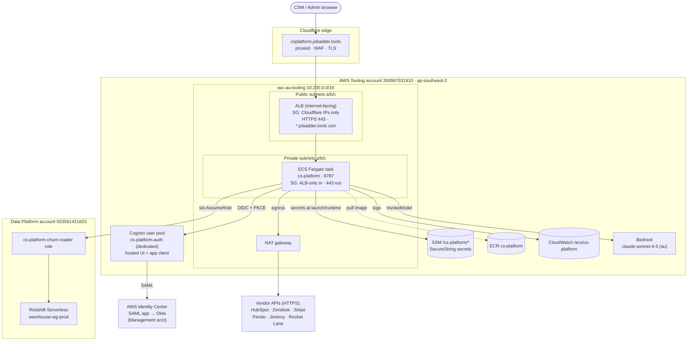
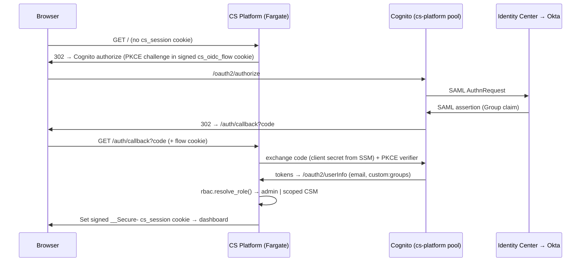
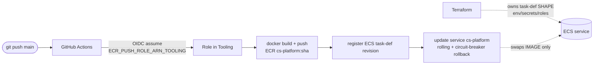

# CS Platform — End-to-End Architecture

CS Platform is a **standalone tool** (separate from JA Observe) deployed in the
**Tooling account `350067031910`**, region `ap-southeast-2`, at
`https://csplatform.jobadder.tools`. This document shows how a request flows from the
browser all the way to live data, how it is deployed, and how it degrades gracefully.

See `infra/` for the Terraform and `infra/RUNBOOK.md` for the deploy steps.

---

## 1. Runtime request flow (edge → app → data)

**Security posture:** the ALB only accepts traffic from Cloudflare edge ranges, so it
cannot be reached directly; the Fargate task has no public IP and only the ALB SG can
reach port 8787; all task egress is TCP 443 via NAT; every secret comes from SSM, none
from code.

---

## 2. Authentication (dedicated SSO round-trip)

Role is resolved from the SAML `Group` claim → `custom:groups`:
`CS-Platform-Admins` → **admin** (all accounts); anyone else → **scoped CSM** (own book
only, matched via HubSpot `hubspot_owner_id` ↔ SSO email). The role lives only in the
HMAC-signed cookie, never in client-editable data.

---

## 3. Deploy pipeline (CI/CD)

Terraform owns the task-definition **shape**; the pipeline owns the running **image**.
The service has `ignore_changes = [task_definition, desired_count]` so the two never
fight.

---

## 4. Graceful degradation (what happens if a dependency isn't wired yet)

| Missing dependency | Behaviour (no crash) |
|--------------------|----------------------|
| Cloudflare DNS record | Domain NXDOMAINs — DNS issue, not the app |
| Identity Center SAML app (`saml_metadata_url=""`) | Pool created without federation; use dev-login path |
| `cs-platform-churn-reader` trust | Churn adapter not-live → transparent computed-risk fallback |
| A vendor API key in SSM | That source reported as a **data gap**, never faked |
| Bedrock access | Agent path unavailable; deterministic dashboard queue still works |

---

## 5. Account / resource summary

| Concern | Resource |
|---------|----------|
| Account | Tooling `350067031910`, `ap-southeast-2` |
| Network | `vpc-0868ddde5e0399b31`, 3 public + 3 private subnets, 1 NAT |
| Domain / TLS | `csplatform.jobadder.tools` (Cloudflare) · `*.jobadder.tools` ACM cert |
| SSO | Dedicated Cognito pool `cs-platform-auth` + `csplatform-jobadder` hosted UI |
| Compute | ECS Fargate cluster + service `cs-platform`, ECR `cs-platform` |
| Secrets | SSM `/cs-platform/*` (8 SecureString params) |
| Churn (cross-acct) | Data Platform `503561421603` · `warehouse-wg-prod` via assumed role |
| LLM | Bedrock `au.anthropic.claude-sonnet-4-5` |
